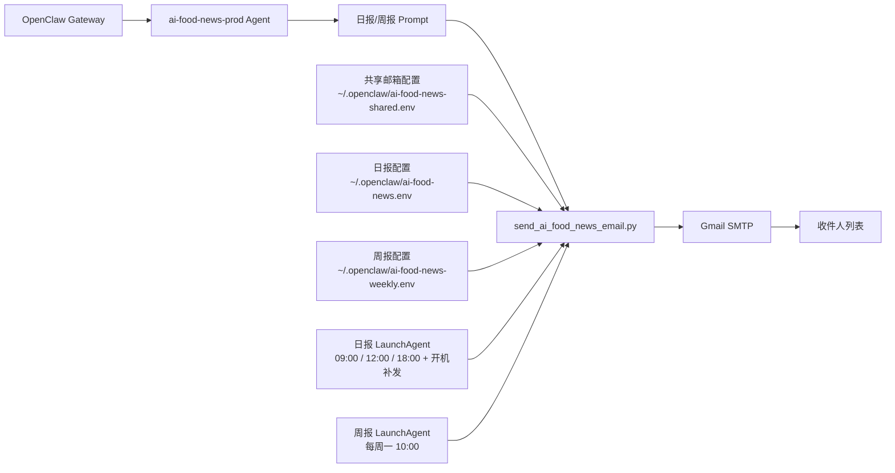

# OpenClaw 资讯智能体架构图

这份文档描述当前 `ai-food-news-prod` 自动化链路的实际结构，以及后续如果你要修改订阅要求、邮件收件人、日报/周报参数，分别应该改哪里。

## 1. 总体结构



## 2. 关键角色

- `OpenClaw Gateway`
  负责调起 agent 和本地工具能力。
- `ai-food-news-prod`
  生产专用资讯智能体，只负责生成可直接发邮件的正文。
- `send_ai_food_news_email.py`
  负责读取配置、调用 OpenClaw、清洗正文、重试失败、通过 Gmail SMTP 发邮件。
- `launchd`
  负责日报和周报的定时触发。

## 3. 你要改什么，就改哪里

### 3.1 修改收件人列表

文件：
[~/.openclaw/ai-food-news-shared.env](/Users/ming/.openclaw/ai-food-news-shared.env)

主要改这行：

```text
AI_FOOD_NEWS_RECIPIENTS=marsming4032351@gmail.com,84369563@qq.com,605229578@qq.com,315865302@qq.com
```

说明：

- 这是共享收件人配置
- 日报和周报都会先读这里
- 以后加人、删人，只改这一处

### 3.2 修改日报参数

文件：
[~/.openclaw/ai-food-news.env](/Users/ming/.openclaw/ai-food-news.env)

常见可改项：

```text
AI_FOOD_NEWS_AGENT=ai-food-news-prod
AI_FOOD_NEWS_TO=+8613900011013
AI_FOOD_NEWS_SUBJECT_PREFIX=今日AI+餐饮观察
AI_FOOD_NEWS_MAX_RETRIES=3
```

说明：

- `AI_FOOD_NEWS_TO`
  日报专用会话键，自动化不要和手动测试混用
- `AI_FOOD_NEWS_SUBJECT_PREFIX`
  决定日报邮件标题前缀
- `AI_FOOD_NEWS_MAX_RETRIES`
  控制失败自动重试次数

### 3.3 修改周报参数

文件：
[~/.openclaw/ai-food-news-weekly.env](/Users/ming/.openclaw/ai-food-news-weekly.env)

常见可改项：

```text
AI_FOOD_NEWS_AGENT=ai-food-news-prod
AI_FOOD_NEWS_TO=+8613900011020
AI_FOOD_NEWS_SUBJECT_PREFIX=本周 AI+餐饮周报
AI_FOOD_NEWS_STATE_FILE=/Users/ming/.openclaw/state/ai-food-news-weekly-last-sent.txt
AI_FOOD_NEWS_PROMPT_FILE=/Users/ming/CaiHub/prompts/ai_food_news_weekly_prompt.txt
AI_FOOD_NEWS_MAX_RETRIES=3
```

说明：

- `AI_FOOD_NEWS_TO`
  周报专用会话键
- `AI_FOOD_NEWS_PROMPT_FILE`
  决定周报内容口径和输出格式

### 3.4 修改订阅要求 / 内容口径

日报主逻辑文件：
[scripts/send_ai_food_news_email.py](/Users/ming/CaiHub/scripts/send_ai_food_news_email.py)

周报 prompt 文件：
[prompts/ai_food_news_weekly_prompt.txt](/Users/ming/CaiHub/prompts/ai_food_news_weekly_prompt.txt)

如果你想改这些，通常就是改 prompt 或正文规则：

- 关注哪些资讯
- 输出偏投资视角还是偏行业快讯
- 标题风格
- 是否要更像微信群转发版
- 是否要更强调趋势判断

### 3.5 修改触发时间

日报 LaunchAgent：
[deploy/ai.caihub.ai-food-news.plist](/Users/ming/CaiHub/deploy/ai.caihub.ai-food-news.plist)

周报 LaunchAgent：
[deploy/ai.caihub.ai-food-news-weekly.plist](/Users/ming/CaiHub/deploy/ai.caihub.ai-food-news-weekly.plist)

当前时间：

- 日报：`09:00 / 12:00 / 18:00`，并支持开机补发
- 周报：每周一 `10:00`

## 4. 当前最重要的边界

### 自动化专用

- `ai-food-news-prod`
- 日报 `AI_FOOD_NEWS_TO=+8613900011013`
- 周报 `AI_FOOD_NEWS_TO=+8613900011020`

### 手动实验专用

不要复用上面两个 `TO`。

如果你手动测试，建议另外用一个新的号码，例如：

```text
+8613900099999
```

这样不会污染自动化邮件内容。

## 5. 最常见修改动作速查

- 想新增收件人：改 [~/.openclaw/ai-food-news-shared.env](/Users/ming/.openclaw/ai-food-news-shared.env)
- 想改日报标题：改 [~/.openclaw/ai-food-news.env](/Users/ming/.openclaw/ai-food-news.env)
- 想改周报标题：改 [~/.openclaw/ai-food-news-weekly.env](/Users/ming/.openclaw/ai-food-news-weekly.env)
- 想改周报内容要求：改 [prompts/ai_food_news_weekly_prompt.txt](/Users/ming/CaiHub/prompts/ai_food_news_weekly_prompt.txt)
- 想改日报/周报触发时间：改对应 `plist`
- 想增强“脏内容拦截”：改 [scripts/send_ai_food_news_email.py](/Users/ming/CaiHub/scripts/send_ai_food_news_email.py)
