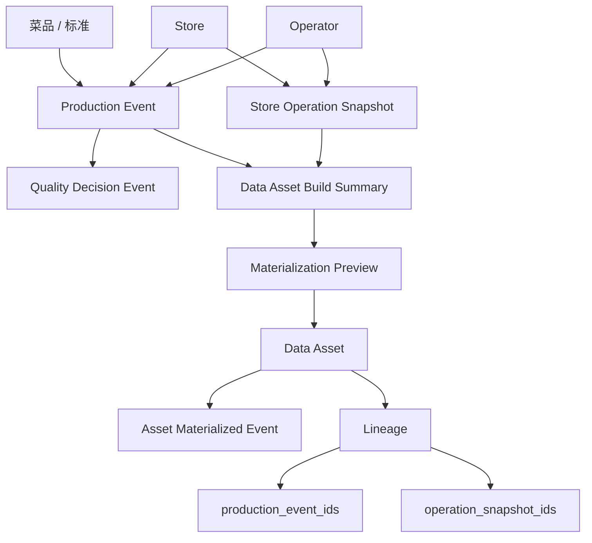

# CaiHub AI Company 架构总图

本文档用于说明 CaiHub 的最终架构方向，以及当前仓库在整体蓝图中的位置。

## 1. 最终系统全景图

```text
┌────────────────────────────────────────────────────────────┐
│                        Mars（Founder）                     │
└────────────────────────────────────────────────────────────┘
                              │
                              ▼
┌────────────────────────────────────────────────────────────┐
│                    CaiHub CEO Agent                        │
└────────────────────────────────────────────────────────────┘
                              │
      ┌───────────────────────┼───────────────────────┬───────────────────────┐
      ▼                       ▼                       ▼                       ▼
┌──────────────┐      ┌──────────────┐        ┌──────────────┐        ┌──────────────┐
│ Vision QA    │      │ Menu R&D     │        │ Store Ops    │        │ Marketing    │
│ Agent        │      │ Agent        │        │ Agent        │        │ Agent        │
└──────────────┘      └──────────────┘        └──────────────┘        └──────────────┘
      │                       │                       │                       │
      └───────────────────────┴───────────────┬───────┴───────────────────────┘
                                              ▼
                                    ┌────────────────┐
                                    │ Data Asset     │
                                    │ Agent          │
                                    └────────────────┘
```

## 2. 四层技术架构

```text
Layer 1  Hardware Layer
  ├── CaiBox
  ├── Camera
  ├── Lighting System
  └── Temperature Sensor

Layer 2  Vision Layer
  ├── Color Recognition
  ├── Plating Recognition
  ├── Ingredient Recognition
  └── Portion Recognition

Layer 3  Agent Layer
  ├── CEO Agent
  ├── Vision QA Agent
  ├── Menu R&D Agent
  ├── Store Ops Agent
  ├── Marketing Agent
  └── Data Asset Agent

Layer 4  Data Asset Layer
  ├── Dish Data
  ├── Kitchen Model
  ├── Store Ops Data
  ├── Menu Knowledge
  └── Quality Event History
```

## 3. 当前仓库代码分层图

```text
app/
├── api/             对外暴露 HTTP 接口
├── core/            应用工厂、配置、生命周期
├── db/              会话、元数据、模型注册
├── models/          ORM 持久化模型
├── schemas/         请求、响应与系统蓝图模型
├── repositories/    数据读写
├── services/        业务逻辑与架构服务
├── domains/         领域数据契约
├── mesh/            数据产品与数据流注册表
├── events/          领域事件
├── agents/          Agent 注册表
├── skills/          Skill 注册表
└── vision/          视觉算法与识别
```

## 4. 当前最核心业务链路

当前代码里已经不只是“出品事件裁决”这一条线，而是形成了一个更完整的最小闭环：



### 这条链今天已经落地到代码中的部分
- `store` / `operator` 实体
- `production_event` 组织语义收口
- `quality decision event`
- `store_operation_snapshot`
- `data asset build summary`
- `data asset materialize preview`
- `data asset materialize`
- `asset.data_asset.materialized` 事件
- `data asset lineage tracking`

## 5. 从当前代码到最终架构的映射

### 当前已存在的基础层
- FastAPI API
- 菜品 / 标准 / 出品事件
- 视觉识别接口
- 质检规则服务
- 数据契约与数据流元数据
- Agent / Skill 注册结构

### 当前还在占位或早期阶段的层
- CEO Agent 的调度与编排能力
- Menu R&D / Store Ops / Marketing / Data Asset 的执行 runtime
- 硬件层的完整设备接入
- 数据资产层的分析、训练、生态导出

## 6. 当前 Data Mesh 视角

```text
Catalog Domain
   └── dish_catalog.v1

Production Domain
   └── dish_production_event.v1

Vision Domain
   └── dish_recognition_result.v1

Operations Domain
   └── store_operation_snapshot.v1

R&D Domain
   └── menu_rnd_knowledge.v1

Marketing Domain
   └── campaign_feedback_event.v1

Asset Domain
   └── restaurant_data_asset.v1

Platform Domain
   └── system_blueprint.v2
```

## 7. Agent / Skill 关系

```text
CEO Agent
  ├── strategy-decomposition
  └── agent-coordination

Vision QA Agent
  ├── multimodal-capture
  └── quality-rule-engine

Menu R&D Agent
  ├── standard-authoring
  └── menu-iteration

Store Ops Agent
  ├── sop-audit
  └── ops-diagnosis

Marketing Agent
  ├── campaign-planning
  └── growth-analysis

Data Asset Agent
  ├── contract-governance
  ├── asset-modeling
  └── flow-mapping
```

## 8. 当前阶段定位

当前 CaiHub 仓库的准确定位是：

- 可运行的 FastAPI 后端基础仓
- 通往 AI Company 的平台底座
- 面向 Agent 协作与数据资产治理的第一阶段代码实现
- 已经形成“组织实体 → 出品事件 → 运营快照 → 数据资产 → 资产事件”的最小可视化闭环

## 8.1 今日工作成果清单（2026-03-10）

```text
文档层
  ├── AI Company 架构统一
  ├── 架构图/发布说明/契约说明更新
  └── 数据契约补齐

代码层
  ├── store / operator
  ├── operations snapshot
  ├── agent runtime skeleton
  ├── orchestration plan skeleton
  ├── data asset domain
  ├── data asset materialization
  ├── asset materialized event
  └── data asset lineage

语义层
  └── production 接口从 store_id/operator_id 向 store_code/operator_code 收口
```

## 9. 下一阶段重点

```text
第一优先级
  ├── asset generation log
  ├── lineage record 拆表/审计化
  ├── production/store/operator 关系校验
  └── Alembic migration 补齐

第二优先级
  ├── event_bus
  ├── analytics_export
  ├── contract_compatibility_test
  └── hardware adapter

第三优先级
  ├── CEO Agent orchestration runtime
  ├── Data Asset feedback loop
  └── API ecosystem
```
