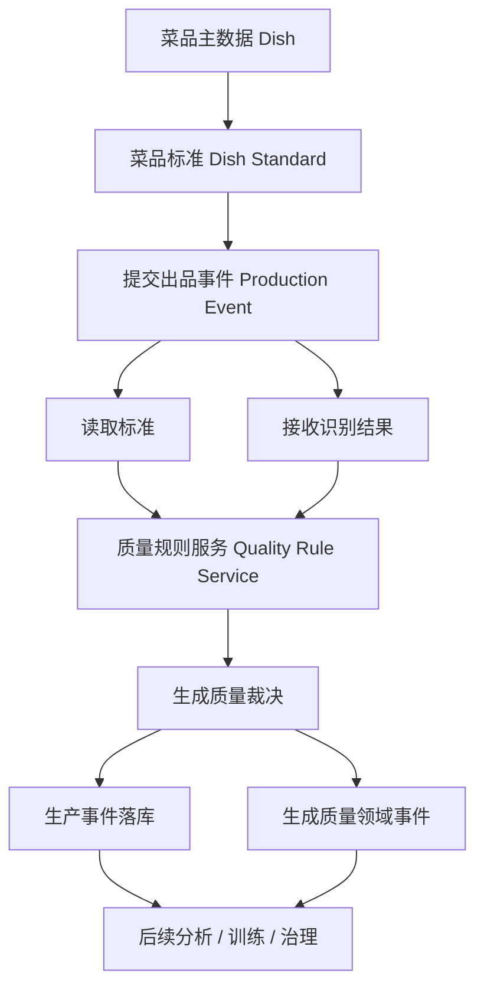
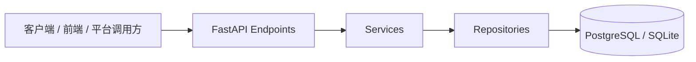
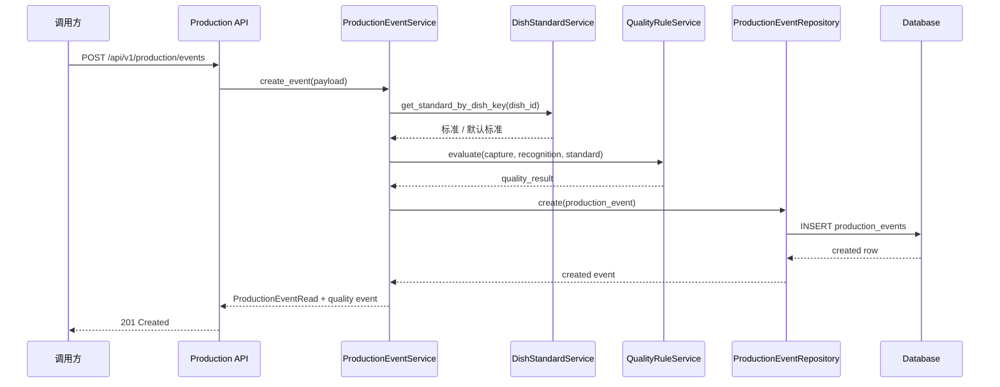
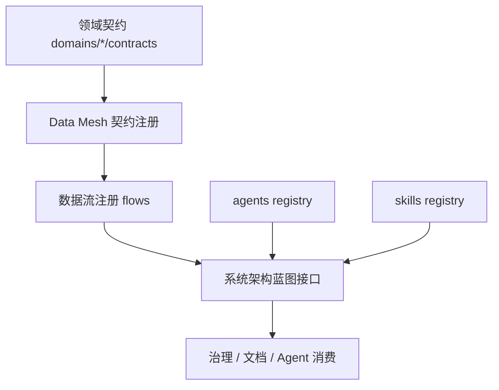
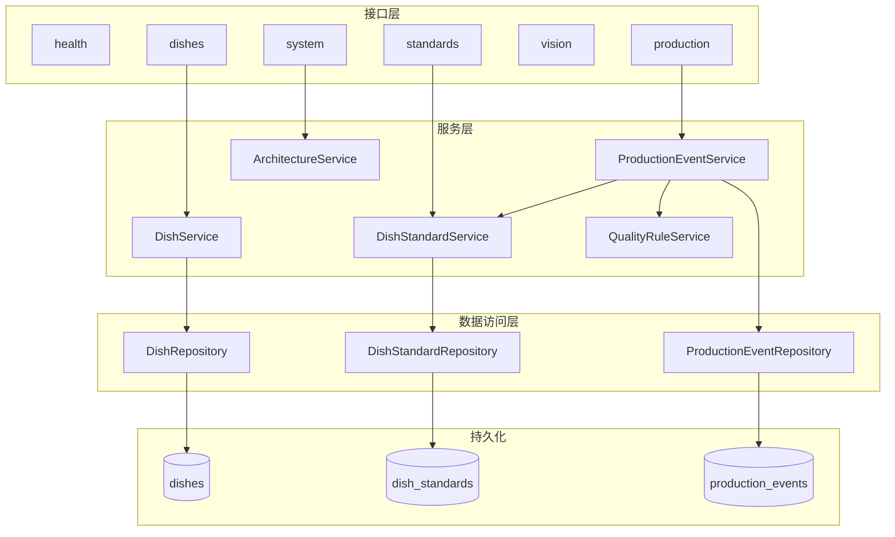
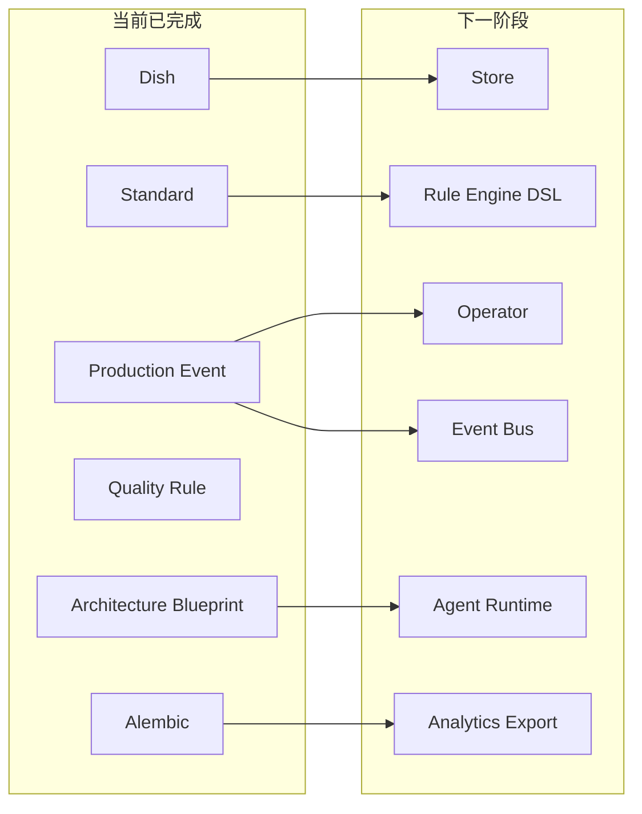

# CaiHub 可视化流程图

本文档使用 Mermaid 描述 CaiHub 当前阶段的核心流程，GitHub 仓库页面可直接渲染。

## 1. 业务主流程

```mermaid
flowchart TD
    A[菜品主数据 Dish] --> B[菜品标准 Dish Standard]
    B --> C[提交出品事件 Production Event]
    C --> D[读取标准]
    C --> E[接收识别结果]
    D --> F[质量规则服务 Quality Rule Service]
    E --> F
    F --> G[生成质量裁决]
    G --> H[生产事件落库]
    G --> I[生成质量领域事件]
    H --> J[后续分析 / 训练 / 治理]
    I --> J
```

## 2. 后端调用链

```mermaid
flowchart LR
    Client[客户端 / 前端 / 平台调用方]
    API[FastAPI Endpoints]
    Service[Services]
    Repo[Repositories]
    DB[(PostgreSQL / SQLite)]

    Client --> API
    API --> Service
    Service --> Repo
    Repo --> DB
```

## 3. 出品事件裁决链路

```mermaid
sequenceDiagram
    participant U as 调用方
    participant P as Production API
    participant S as ProductionEventService
    participant DS as DishStandardService
    participant Q as QualityRuleService
    participant R as ProductionEventRepository
    participant DB as Database

    U->>P: POST /api/v1/production/events
    P->>S: create_event(payload)
    S->>DS: get_standard_by_dish_key(dish_id)
    DS-->>S: 标准 / 默认标准
    S->>Q: evaluate(capture, recognition, standard)
    Q-->>S: quality_result
    S->>R: create(production_event)
    R->>DB: INSERT production_events
    DB-->>R: created row
    R-->>S: created event
    S-->>P: ProductionEventRead + quality event
    P-->>U: 201 Created
```

## 4. Data Mesh 治理链

```mermaid
flowchart TD
    A[领域契约 domains/*/contracts] --> B[Data Mesh 契约注册]
    B --> C[数据流注册 flows]
    C --> D[系统架构蓝图接口]
    D --> E[治理 / 文档 / Agent 消费]

    F[agents registry] --> D
    G[skills registry] --> D
```

## 5. 当前模块关系图

```mermaid
flowchart TB
    subgraph API[接口层]
        A1[health]
        A2[dishes]
        A3[standards]
        A4[production]
        A5[vision]
        A6[system]
    end

    subgraph Services[服务层]
        S1[DishService]
        S2[DishStandardService]
        S3[ProductionEventService]
        S4[QualityRuleService]
        S5[ArchitectureService]
    end

    subgraph Repos[数据访问层]
        R1[DishRepository]
        R2[DishStandardRepository]
        R3[ProductionEventRepository]
    end

    subgraph Data[持久化]
        D1[(dishes)]
        D2[(dish_standards)]
        D3[(production_events)]
    end

    A2 --> S1 --> R1 --> D1
    A3 --> S2 --> R2 --> D2
    A4 --> S3 --> R3 --> D3
    S3 --> S2
    S3 --> S4
    A6 --> S5
```

## 6. 当前能力与下一阶段扩展

```mermaid
flowchart LR
    subgraph Current[当前已完成]
        C1[Dish]
        C2[Standard]
        C3[Production Event]
        C4[Quality Rule]
        C5[Architecture Blueprint]
        C6[Alembic]
    end

    subgraph Next[下一阶段]
        N1[Store]
        N2[Operator]
        N3[Rule Engine DSL]
        N4[Event Bus]
        N5[Analytics Export]
        N6[Agent Runtime]
    end

    C1 --> N1
    C2 --> N3
    C3 --> N2
    C3 --> N4
    C5 --> N6
    C6 --> N5
```
